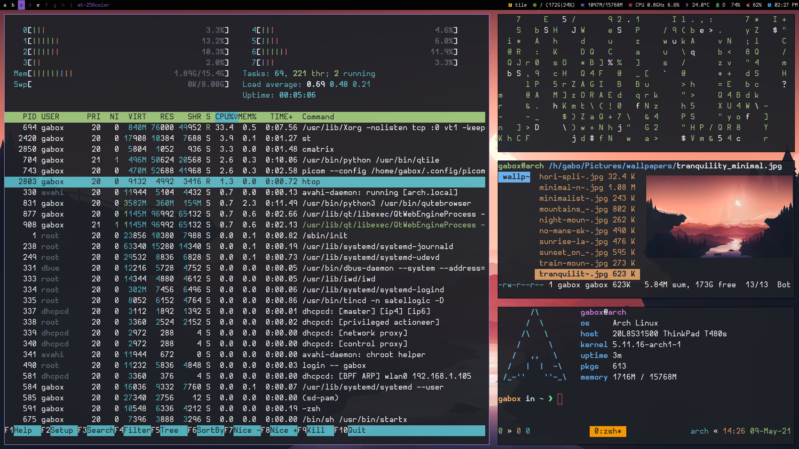

# dotfiles

- OS: [Arch Linux](https://archlinux.org/)
- WM: [Qtile](http://www.qtile.org/)
- Shell: [zsh](https://www.zsh.org/)
- Terminal: My [own](https://github.com/centaurialpha/st) build of [st](https://st.suckless.org/)
- Editor: [Neovim](https://neovim.io/)
- Browser: [qutebrowser](https://qutebrowser.org/)
- Launcher: My [own](https://github.com/centaurialpha/dmenu) build of [dmenu](https://tools.suckless.org/dmenu/)
- File Manager: [ranger](https://ranger.github.io/)
- Compositor: [picom](https://github.com/yshui/picom)

## Screenshot


## How to install
```
echo ".dotfiles" >> .gitignore
git clone --bare https://github.com/centaurialpha/dotfiles.git $HOME/.dotfiles
alias dotfiles='/usr/bin/git --git-dir=$HOME/.dotfiles/ --work-tree=$HOME'
dotfiles checkout
dotfiles config --local status.showUntrackedFiles no
```

### Neovim plugin manager
```
sh -c 'curl -fLo "${XDG_DATA_HOME:-$HOME/.local/share}"/nvim/site/autoload/plug.vim --create-dirs \
       https://raw.githubusercontent.com/junegunn/vim-plug/master/plug.vim'
```

Inside nvim: `:PlugInstall`

### Qutebrowser theme
```
git clone https://github.com/dracula/qutebrowser-dracula-theme.git ~/.config/qutebrowser/dracula
```
